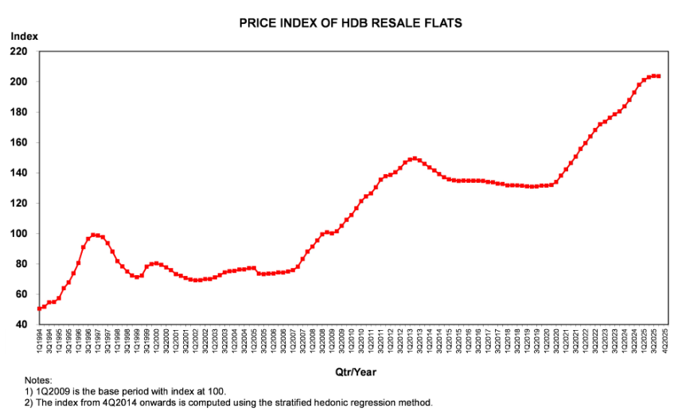

# HDB Price Projection ML

---

## About

An ML model to forecast future HDB resale prices based on historical data, Resale Price Index (RPI) and geographical data.

## Why use Resale Prince Index (RPI) to adjust the resale price?

In the original dataset, the resale price has inflation baked in, which when used for model training would act as an invisible feature which we cannot control.
Prediction would then become less reliable as time factor was not considered. 

To solve this issue, we refer to the RPI provided by HDB here:
https://www.hdb.gov.sg/-/media/doc/EAPG-CSC/4Q2025-RPI-Table.pdf

Basically RPI of 100 is the baseline which is from 2009 Q1.
An RPI of 205 for example means the current quarter inflation price is 2.05x times of the 2009 Q1 price

Hence, we map the resale flat price to the RPI index, and make it back to 100.

The formula will be: **(Resale flat price / RPI index of the quarter) x 100**

Doing so adjusts the resale price to values it would have been in 2009, this allows the model to train without the visible and invisible time factors.

### How to adjust it back?

We will use another model later on, which is trained on the RPI index to attempt to predict the RPI for the year. But generally it hovers around 1-4% flunctuation per quarter.

Our propose solution will force the 

## Why are the additional features important
Through asking a property agent in Singapore, we've learnt that nearby Amenities are a big contributing factor to the price of the HDB resale flat.
These include but are not limited to:
- number of Bus Stops
- number of MRT Stations
- number of Malls
- number of Hawker Centres
- number of Schools (Certain Schools will affect the price greater)
- Distance to nearest bus stop
- Distance to nearest MRT station.

Hence for this ML project, we used geo data to obtain the locations of these amenities.
Typically the term used for "nearby" is "within walking distance". As this is a figure that varies from person to person, our team simply took a radius of 500m around the flat to count number of amenities.

## Wouldn't the amenities also be dependent on the year as well?
You are right, but since we strip all time based features during our model training, if we were to fine tune, which year had what amenities nearby. It will confuse the model even more as it wonders why these two similar flats near each other have different number of amenities.

Hence, we believe keeping it consistent and apply it to all data be better for the model to train and predict with better accuracy.

## Project Scope

- **Geography**: Singapore HDB estates
- **Property Type**: Resale flats only (2-room to Executive)
- **Time Period**: 2017-2025 transactions
- **Features**: Location, amenities, physical attributes, lease information

## Required dependencies

pip install -r "requirements.txt"

## Dataset

1. [HDB Resale Price Data (gov.sg)](https://data.gov.sg/datasets/d_8b84c4ee58e3cfc0ece0d773c8ca6abc/view)

## Amenity Data Sources
2. **MRT Stations**: OpenStreetMap
3. **Bus Stops**: OpenStreetMap
4. **Schools**: OpenStreetMap
5. **Shopping Malls**: OpenStreetMap
6. **Hawker Centres**: OpenStreetMap
7. **Wet Markets**: OpenStreetMap

## Generated Features
- Geocoded addresses (latitude/longitude)
- Distance to nearest amenities (meters)
- Amenity counts within 500m radius
- Inflation-adjusted prices (RPI-based)
- Storey categories (lower/middle/upper)